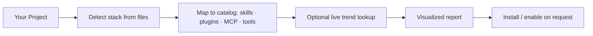
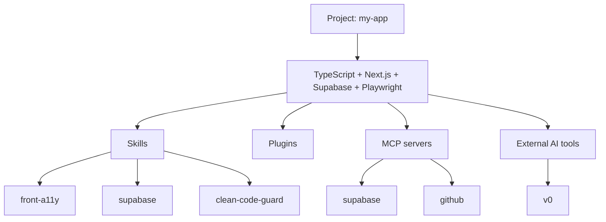

# 🧭 project-compass

**Stop guessing your AI tooling. Know exactly which skills, plugins, MCP servers, and AI tools your project actually needs — detected from your code, visualized in one report, installable in one step.**

[](LICENSE)
[](https://opencode.ai)
[](https://claude.com/claude-code)
[](https://cursor.com)
[](https://github.com/AHMEDGabal1/opencode-project-compass)

---

## The problem

Every project is a different stack — and every stack wants a different set of
AI helpers. But nobody sits down and figures out *which* skills, plugins, and
MCP servers actually match **this** codebase. So you end up with:

- Tooling you don't need (a Postgres MCP on a static site 🤦)
- Gaps you didn't know you had (no accessibility review on a React app)
- A pile of "trending" AI tools you heard about but never vetted

**project-compass fixes that.** It reads your project, maps it to the right
tooling, and hands you a clean, visualized plan — then wires it in when you say go.

---

## What it does

| | |
|---|---|
| 🔍 **Detects from real files** | Reads `package.json`, `pyproject.toml`, `go.mod`, `composer.json`, `.supabase/`, `docker-compose.yml`… never the folder name. |
| 🗺️ **Maps to the right stack** | Pulls matched skills, plugins, MCP servers, and AI tools from a curated catalog. |
| 🌐 **Finds what's new** | Optional live web lookup for the latest AI dev tools and MCP servers in your stack. |
| 📊 **Visualizes it** | A Mermaid diagram + priority table + a 0–100 readiness score. |
| ⚡ **Installs on request** | Emits (and runs, if you approve) the exact commands for your agent. |
| 🧹 **Stays minimal** | Explicitly skips tools your stack doesn't need. No bloat. |

---

## How it works



1. **Detect** — identifies languages, frameworks, domains, and test tooling from actual config files.
2. **Map** — matches each signal to recommendations in the catalog, tagged `must` / `nice` / `watch`.
3. **Discover** — when you want freshness, fetches current AI tools and trends for your stack (with sources).
4. **Report** — renders a Mermaid map, a priority table, and a readiness score.
5. **Manage** — only when you ask, installs/enables the tools with verified commands.

---

## Sample report



| Tool | Type | Why it fits | Priority | Install / enable |
|------|------|-------------|----------|------------------|
| `supabase` skill | skill | Supabase dep detected in project | must | copy `SKILL.md` |
| `front-a11y` skill | skill | React/Next frontend | must | copy `SKILL.md` |
| supabase MCP | mcp | DB access for the project | must | `opencode mcp add supabase` |
| github MCP | mcp | PRs & CI | nice | `opencode mcp add github` |
| v0 | tool | UI generation for Next | nice | web |

**Readiness: 80/100** — missing `github` MCP (CI visibility).

---

## Works with your agent

project-compass is **instruction-only** — it runs anywhere a skill/rule system
exists. Only the install commands differ:

| Agent | Install skill to | Enable plugins / MCP |
|-------|------------------|----------------------|
| **opencode** | `~/.agents/skills/project-compass/` | `opencode plugin add <name>` · `opencode mcp add <name> -- <args>` |
| **Claude Code** | `.claude/skills/project-compass/SKILL.md` | `claude mcp add <name>` · edit `.mcp.json` |
| **Cursor** | `.cursor/rules/project-compass.md` | configure `mcp.json` |
| **Other** | drop `SKILL.md` into the agent's skills/rules folder | follow that agent's MCP format |

The skill always emits the opencode command **and** notes the equivalent for other agents.

---

## Getting started

**opencode**
```bash
git clone https://github.com/AHMEDGabal1/opencode-project-compass.git
cp -r opencode-project-compass ~/.agents/skills/project-compass
```
Then in any project: *"What skills, plugins, and MCPs do I need for this project?"*

**Claude Code**
```bash
git clone https://github.com/AHMEDGabal1/opencode-project-compass.git
mkdir -p ~/.claude/skills/project-compass
cp opencode-project-compass/SKILL.md ~/.claude/skills/project-compass/
```

---

## What's in the box

```
project-compass/
├── SKILL.md                  # the skill (agent instructions)
├── references/
│   ├── catalog.md            # curated stack → tooling map + live-trend seeds
│   └── report-template.md    # Mermaid + table + score output format
└── README.md
```

---

## Philosophy

> The best tooling is the tooling you actually use. project-compass recommends the
> **minimum that fits** — and tells you, out loud, what it skipped and why.

No padding. No fabricated commands. No "trending" tools your stack can't use.

---

## License

MIT — use it, fork it, ship it.
